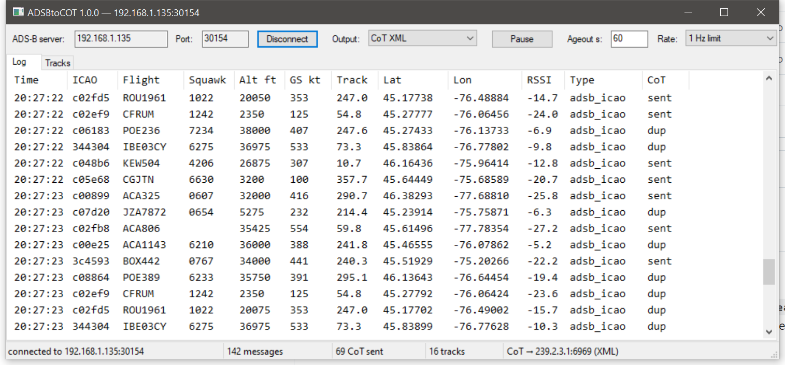

# ADSBtoCOT

[](https://github.com/Flinterpop/ADSBtoCOT/releases/latest)
[](https://github.com/Flinterpop/ADSBtoCOT/releases)
[](LICENSE)

C++ apps that connect to a readsb/dump1090 newline-delimited JSON feed
(e.g. `readsb --net-json-port`), show a live log of received ADS-B
messages, and forward each position as a Cursor-on-Target (CoT) event over
UDP for TAK clients (ATAK/WinTAK/iTAK). Two front-ends share one core:

- `adsbtocot` — console app.
- `adsbtocot_gui` — Windows UI: top bar with ADS-B server IP/port and a
  Connect/Disconnect toggle (Enter also triggers it; connecting uses the
  address in the boxes), a CoT output format selector (CoT XML / TAK
  Protobuf), a send-rate selector (No limit / 1 Hz limit / 1 Hz + fill), a
  Pause button that freezes log scrolling (collection continues), and a
  track ageout in seconds (default 60; 0 disables). Below, two tabs:
  **Log** (scrolling message log) and **Tracks** (one row per unique
  aircraft, updated in place with latest values, message count, last-seen
  time, and age; tracks not heard from within the ageout window are
  dropped). Status bar shows connection state, message/CoT/track counters,
  and the CoT destination. All settings persist between runs (see below).

No external dependencies — plain Winsock/BSD sockets, Win32 common
controls, a minimal JSON field extractor, and a hand-rolled protobuf
encoder. Reconnects automatically if the feed drops.



### Screenshots


## CoT output

- Formats: CoT XML, or TAK Protocol Version 1 mesh SA protobuf
  (`0xbf 0x01 0xbf` + `TakMessage`). Switchable live in the GUI;
  pass `proto` as the console app's 5th argument.
- Default destination is the standard TAK mesh SA multicast group
  `239.2.3.1:6969`; any unicast host:port works too.
- **Send rate** (GUI "Rate:" selector, default "1 Hz limit"):
  - *No limit* — forward every ADS-B message that has a position (1 in /
    1 out); highest traffic.
  - *1 Hz limit* — at most one CoT event per aircraft per second, matching
    the update rate TAK clients expect.
  - *1 Hz + fill* — like 1 Hz, but when an aircraft goes a full second with
    no fresh message its last position is re-sent as a fill heartbeat, so
    every active track updates at a steady 1 Hz (fills stop after 60 s of
    silence).
  The log's CoT column shows `sent`, `dup` (a rate-limited duplicate),
  `fill` (a heartbeat re-send), `no-pos` (message had no lat/lon), or blank
  (CoT disabled). Fills are counted as CoT sent but do not advance the
  received-message count or reset a track's age.
- Events use uid `ICAO-<hex>`, the flight callsign (falling back to the hex
  code), geometric altitude as HAE in meters, course/speed, and squawk in
  remarks. Emitter category maps to the CoT type (rotorcraft → `a-n-A-C-H`,
  lighter-than-air → `a-n-A-C-L`, otherwise fixed wing `a-n-A-C-F`).
- Rate limiting follows the selected send rate (above); CoT events go stale
  120 seconds after they are sent.
- Records without a position are logged but not forwarded.

## Settings

The GUI remembers your settings between runs in
`%APPDATA%\ADSBtoCOT\adsbtocot.ini`: ADS-B server host/port, CoT
destination, output format, send rate, track ageout, and window
size/position. They are saved when changed and on close, and reloaded at
startup. Command-line arguments, when given, override the saved values for
that run.

## Releases

Prebuilt Windows x64 binaries are attached to each
[GitHub release](https://github.com/Flinterpop/ADSBtoCOT/releases/latest).
Download `adsbtocot-<version>-win64.zip`, extract, and run
`adsbtocot_gui.exe` (GUI) or `adsbtocot.exe` (console) — no runtime or
dependencies to install. See [CHANGELOG.md](CHANGELOG.md) for release notes.

## Build

```
cmake -S . -B build
cmake --build build --config Release
```

## Run

```
build\Release\adsbtocot_gui.exe [adsb_host] [adsb_port] [cot_host] [cot_port]
build\Release\adsbtocot.exe     [adsb_host] [adsb_port] [cot_host] [cot_port] [xml|proto]
```

Defaults to `192.168.1.135 30154 239.2.3.1 6969`. Pass `-` as `cot_host`
for log-only mode with no CoT output.

## License

Released under the [MIT License](LICENSE).
